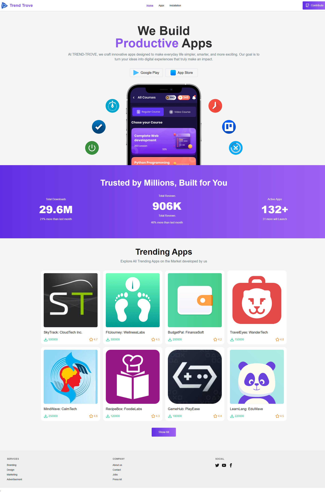

# 🚀 App Store – Explore, Install & Discover Apps

A modern, responsive **React-based App Store** web application that allows users to browse, search, and explore apps dynamically. Users can view app details, install apps (saved in local storage), and experience smooth UI interactions with live search, toasts, and loading animations.

---

## 📝 Description

The **App Store** project provides a simulated app marketplace experience built using modern frontend tools. It includes:

* Dynamic routing for app details.
* Live search functionality with instant filtering.
* Installation simulation with local storage persistence.
* Toast notifications for user feedback.
* Elegant UI with loading animations and error handling (e.g., App Not Found page).

This project is designed as a frontend demonstration of how a real app store might look and function using React and Tailwind CSS.

---

## 🧠 Key Features

* 🔍 **Live Search:** Instantly filter apps as you type.
* ⚙️ **App Details Page:** Displays detailed information for each app.
* 📦 **Install Simulation:** Click “Install Now” to save apps in local storage.
* ⚠️ **Error Handling:** Displays a relevant message if an app isn’t found.
* 💬 **Toast Notifications:** Instant feedback for user actions.
* 🎨 **Responsive Design:** Fully optimized for mobile and desktop.

---

## 🧰 Technologies Used

| Category            | Technologies                       |
| ------------------- | ---------------------------------- |
| **Frontend**        | HTML, CSS, React                   |
| **Styling**         | Tailwind CSS, DaisyUI              |
| **State & Routing** | React Router                       |
| **UI Enhancements** | React Toastify, Lucide React Icons |

---

## ⚙️ Setup Instructions

1. Clone the repository

   ```bash
   git clone https://github.com/ebrahim2355/app-container-project.git
   cd app-container-project
   ```

2. Install dependencies

   ```bash
   npm install
   ```

3. Run the development server

   ```bash
   npm run dev
   ```

4. Open in browser

   ```
   http://localhost:5173/
   ```

---

## 📸 Preview


.png)
.png)

---

## 👨‍💻 Author

**MD. Ebrahim Ali**
Frontend Developer | React Enthusiast

---

## 🪪 License

This project is open-source and free to use for learning and portfolio purposes.
